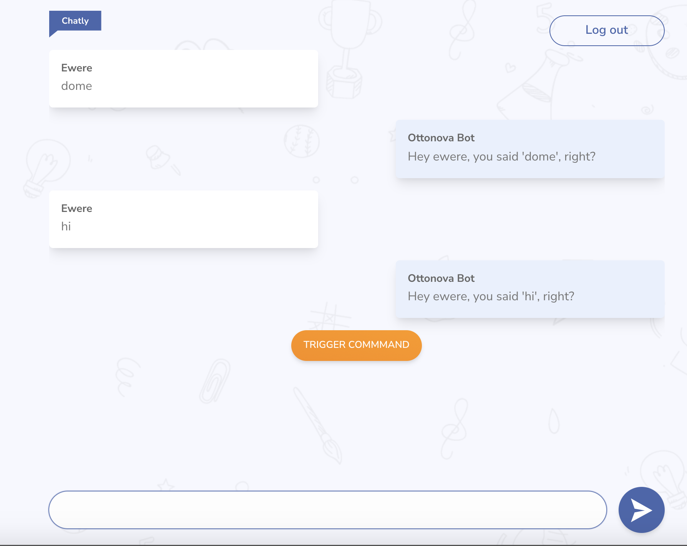

<!-- PROJECT LOGO -->
<br />
<p align="center">
  <a href="https://cranky-poitras-85c72f.netlify.app">
    
  </a>

  <p align="center">
    A Chat bot app
    <br />
    <a target="_blank" href="https://cranky-poitras-85c72f.netlify.app"><strong>View App»</strong></a>
    <br />
    <br />
    <a target="_blank" href="https://www.pivotaltracker.com/n/projects/2535362">Project Planning board in Pivotal Tracker</a>
    <br />
    <a target="_blank" href="https://whimsical.com/chat-app-Ly44A33XdAGVcxqrYDuzio">UX Design on whimsical</a>
    <br />
    <a target="_blank" href="https://www.figma.com/file/w57o4JkQgTtvOUPPlfuDtw/Chatly?node-id=0%3A1">UI/UX design on Figma</a>
  </p>
</p>

<!-- TABLE OF CONTENTS -->

## Table of Contents

- [About the Project](#about-the-project)
  - [Built With](#built-with)
- [Getting Started](#getting-started)
  - [Prerequisites](#prerequisites)
  - [Installation](#installation)
- [Usage](#usage)
- [Acknowledgements](#acknowledgements)

<!-- ABOUT THE PROJECT -->

## About The Project



A simple chat bot app to demonstrate my understanding of react, socket io, firebase authetication, and Google Map API integrations.

### Built With

- [Node](https://nodejs.org)
- [React](https://reactjs.org)
- [Chakra UI](https://chakra-ui.com/)
- [Redux tool-kit](https://redux-toolkit.js.org/)
- [Firebase](https://firebase.google.com/)
- [Socket io](https://socket.io/)
- [Google Maps API](https://developers.google.com/maps)

<!-- GETTING STARTED -->

## Getting Started

To get a local copy up and running follow these simple steps.

### Prerequisites

This is an example of how to list things you need to use the software and how to install them.

- npm

```sh
npm install npm@latest -g
```

- yarn

```sh
npm install --global yarn
```

### Installation

#### 1. Clone the repo

```sh
git clone https://github.com/caleb-42/chat-app.git
```

#### 2. Install NPM packages

```sh
yarn install
```

#### 3. Create your env file named .env at the root of the project

```sh
REACT_APP_NODE_ENV=development
PORT=3000
REACT_APP_API_KEY=<FIREBASE API KEY>
REACT_APP_AUTH_DOMAIN=<FIREBASE AUTH DOMAIN>
REACT_APP_PROJECT_ID=<FIREBASE PROJECT ID>
REACT_APP_STORAGE_BUCKET=<FIREBASE STORAGE BUCKET>
REACT_APP_MESSAGING_SENDER_ID=<FIREBASE MESSAGING SENDER ID>
REACT_APP_APP_ID=<FIREBASE APP ID>
REACT_APP_SOCKET_ENDPOINT=<FIREBASE SOCKET ENDPOINT>
REACT_APP_GOOGLE_API_KEY=<GOOGLE API KEY> // activate Geocoding API & Maps JavaScript API
```


#### 4. Run Tests (Used Jest and Puppeteer)
```sh
yarn test
```
<!-- USAGE EXAMPLES -->

## Usage

_To get started, please refer to the [Hosted App](https://cranky-poitras-85c72f.netlify.app)_

<!-- ACKNOWLEDGEMENTS -->

## Acknowledgements
Used the following free services
- [Netlify](https://www.netlify.com)
- [Github](https://github.com)
- [Pivotal Tracker](pivotaltracker.com)
